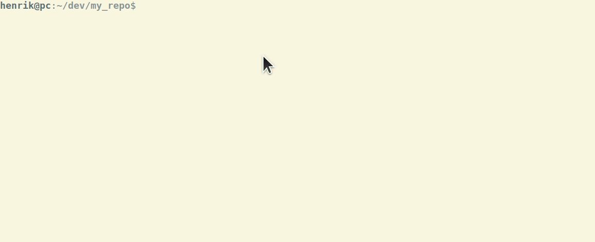

# Unsentimental versioning

Most projects I've worked on have tried to follow semantic versioning, and it is probably one of the most used strategies for versioning software. It has a clear and strict [specification](https://semver.org/). The problem occurs when a developer tries to follow this specification.

Semantic versioning is defined like this: MAJOR.MINOR.PATCH
* MAJOR: breaking changes
* MINOR: add functionality in a backwards-compatible manner
* PATCH: backwards-compatible bug fixes

This means that upon a new release the developer must to go through all changes since last release to figure out the next version number. This could prove to be difficult and time consuming. Often it leads to [sentimental versioning](http://sentimentalversioning.org/). To avoid this, we must remove all human interaction.

We can achieve this by using a *semantic-release*. It is a tool that examines the commit messages and, on this basis, it automatically derives the next version number for the next release. This means that all the team members must use the same standard when writing commit messages. 

Since we already established that humans are not trustworthy, we will use a command line tool that asks the developer some questions and generates a commit message from these answers. It is called [commitizen](https://commitizen.github.io/cz-cli/) and is great for standardizing commit messages. After installing it we must use `gi cz` instead of `git commit -m "commit message"`. The procedure is like this:

Example on other commit messages generated from these questions:
<table>
 <tr>
   <th style="max-width: 100px;">Commit message</th>
   <th>Release type</th>
 </tr>
    <tr>
        <td>fix(pencil): stop graphite breaking when too much pressure applied</td>
        <td>Patch Release</td>
    </tr>
        <tr>
        <td>feat(pencil): add 'graphiteWidth' option</td>
        <td>Feature Release</td>
    </tr>
        <tr>
        <td>perf(pencil): remove graphiteWidth option. 
             
            BREAKING CHANGE: The graphiteWidth option has been removed.
             
            The default graphite width of 10mm is always used for performance reasons.</td>
        <td>Breaking Release</td>
    </tr>
</table>

When we have the commit messages structured in this format, we can utilize semantic-release. It is meant to be executed on the CI environment after every successful build on the release branch. This way no human is directly involved in the release process and the releases are guaranteed to be unromantic and unsentimental.

Semantic-release is a npm package and originally made for node projects. By using a plugin, you can use it on all types of projects. The plugin is called [semantic-release/exec](https://github.com/semantic-release/exec) and will provide you with the new version number and let you execute your own commands so you can i.e. create assemblies with the new version number.

https://gist.github.com/mindplay-dk/51a1b2f6bc3ae88082dba3eeb6b7198e
https://gist.github.com/jashkenas/cbd2b088e20279ae2c8e

https://semantic-release.gitbook.io/semantic-release/
https://commitizen.github.io/cz-cli/
http://sentimentalversioning.org/
